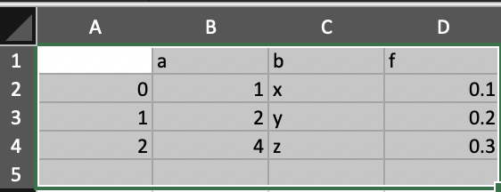

# pd-replicator
Copy a pandas DataFrame to the clipboard with one click


## Installation

Installation can be done through `pip`:

```sh
> pip install pd-replicator
```

`ipywidgets` must be setup in order for the button/dropdown to display correctly:

```sh
> pip install ipywidgets 
> jupyter nbextension enable --py widgetsnbextension
```

To use with JupyterLab, an additional step is required:

```sh
> jupyter labextension install @jupyter-widgets/jupyterlab-manager
```

## Usage

`pd-replicator` can be used in classic Jupyter, JupyterLab, and Google Colaboratory. 

It can be used on both local and remotely hosted instances (such as AWS SageMaker or JupyterHub).

### Enabling the Copy Button

Wrap `replicator()` around any `pandas` DataFrame/Series to display the replicator copy button above the DataFrame/Series:

```python
from pd_replicator import replicator

replicator(df)
```

For remotely hosted instances, the `native` option should be set to `False`:

```python
from pd_replicator import replicator

replicator(df, native=False)
```

This uses JavaScript to copy to the clipboard through your browser, rather than the system copy method used by `pandas.to_clipboard()`.

### Using the Copy Button

Clicking the "Copy" button will copy the associated DataFrame/Series to your clipboard in tab-seperated form. This means the DataFrame/Series can be pasted directly into Excel or Google Sheets without needing to split the text.

For example, selecting a single cell and pasting will result in something like this:



### Using the Dropdown

The dropdown allows some control over what is copied to your clipboard when you press the "Copy" button.


You can choose to exclude the index, header, or both from being copied.
